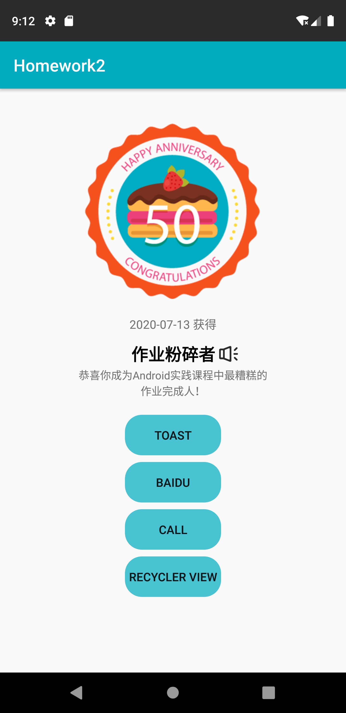
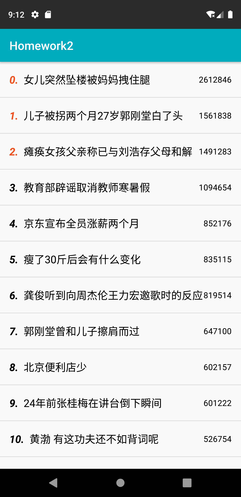

# Homework2

- [x] 创建Activity
- [x] Button和Toast功能
- [x] 三种Activity跳转
  - [x] PracticeActivity
  - [x] 百度页面
  - [x] 电话拨号页面
- [x] 在Log中打印Activity各生命周期
- [x] 页面绘制-图片和圆角按钮
- [x] RecyclerView

#### Preview

