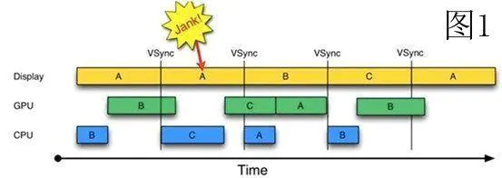

##  Tikee

> Collection of my life
>
> 我的视频日记

- [x] 播放界面

  - [x] 单击暂停播放

- [x] 视频列表

- [x] 视频拍摄 `RecordingActivity`

  - [x] camerax 预览
  - [x] camerax 拍摄
  - [ ] 确认或取消

- [x] 上传 `UploadActivity`

  - [ ] 封面选择
  - [x] 文本编辑
  - [x] POST

  

#### Notes

* 隐藏ActionBar

  [Android学习笔记显示和隐藏ActionBar - 千雨千寻 - 博客园 (cnblogs.com)](https://www.cnblogs.com/lzpq/p/12926647.html)

* Splash开屏

  [安卓开发笔记（二十六）：Splash实现首页快速开屏功能 - Geeksongs - 博客园 (cnblogs.com)](https://www.cnblogs.com/geeksongs/p/10753353.html)

  [Android SplashActivity - 简书 (jianshu.com)](https://www.jianshu.com/p/74c8ffde68ee)

* 

  一个固定的脉冲信号——VSync，每一次 VSync 信号来了 CPU 就开始运行绘制代码(例如运行 View.draw 之类的方法)，当 CPU 的数据准备好了，就将这些数据交给 GPU 让其在一块内存缓冲区上进行图像的绘制。当 GPU 绘制好了就将图像显示到屏幕上。

* 淡入淡出动画

  [(8条消息) Activity切换动画，实现淡入淡出，滑入滑出_huangchangsheng123的博客-CSDN博客](https://blog.csdn.net/huangchangsheng123/article/details/79580573)

* [【Android】使用CameraX实现拍照和录制视频 - 简书 (jianshu.com)](https://www.jianshu.com/p/ffb0c936757b)

* [Android: PreviewView causes crash in dynamic feature module - Stack Overflow](https://stackoverflow.com/questions/64231859/android-previewview-causes-crash-in-dynamic-feature-module)

* `android:hint="在此输入文字 ..."`

